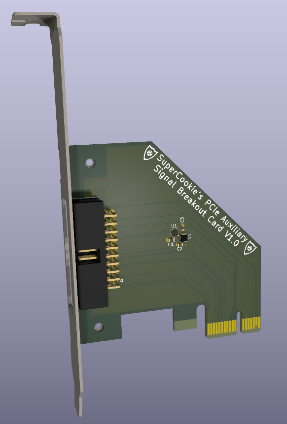

# PCIe Auxiliary Signal Breakout Card

## Overview
The PCIe Auxiliary Signal Breakout Card is designed to make the auxiliary signals in a PCIe connection available to the user. This includes SMBus and JTAG. The card also provides 12V, 5V and 3.3V power and the PCIe reset signal which also functions as a 3.3V and 12V power good signal.

## Specifications

* 10W Total Power Output
    * Up to 3.0A on 3.3V
    * Up to 1.0A on 5V (optional)
    * Up to 0.5A on 12V
    * Up to 0.375A on 3.3V Aux
* Open-Drain SMBus
    * 3.3V Signal Levels
* IEEE Standard 1149.1 JTAG
    * 3.3V Signal Levels
* Always on 3.3V Aux rail
* Standard and Low Profile Brackets included

## Pinout

## Instructions

* [Ordering Instructions](Instructions/PCB_Order_Instructions.md)
* [KiCad Instructions](Instructions/KiCad_Install_Instructions.md)
* [Soldering Instructions](Instructions/Soldering_Instructions.md)
* [3D Printing Instructions](3D-Printing)
  
## Issues and Feature Requests

| Issue/Feature | Issue Number | Status | Version Milestone |
|-------|--------|--------|--------|
